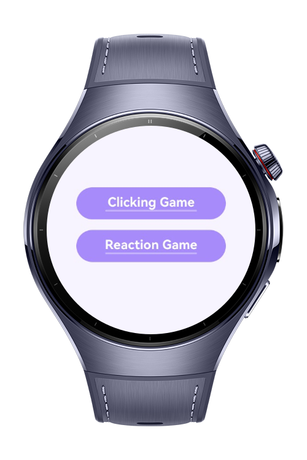
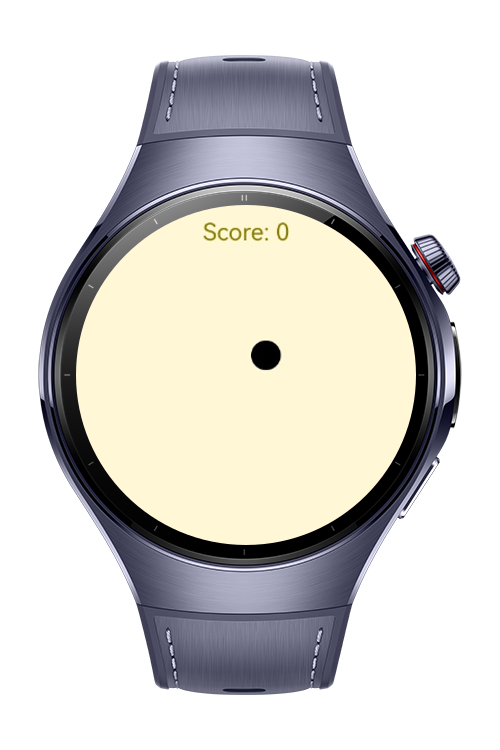
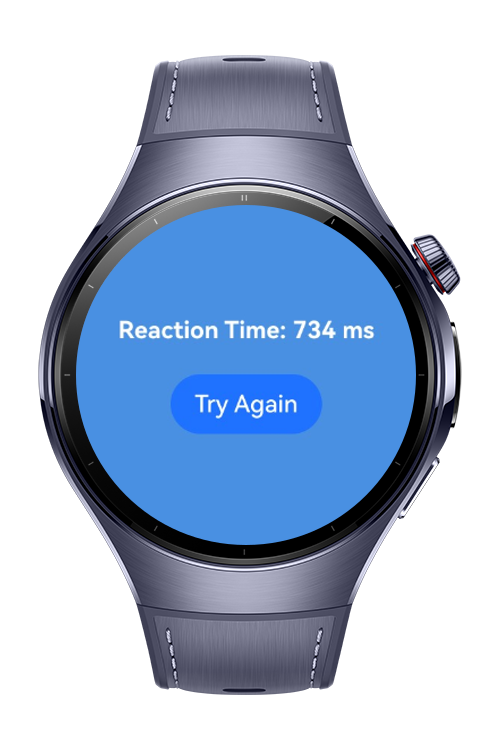

> **Note:** To access all shared projects, get information about environment setup, and view other guides, please visit [Explore-In-HMOS-Wearable Index](https://github.com/Explore-In-HMOS-Wearable/hmos-index).

# Reafy

Reflex Trainer is a smartwatch application built with ArkTS, designed to help users improve and measure their reaction speed in a fun and interactive way.
The app includes two compact games optimized for smartwatch screens:

Clicking Game – tap shrinking targets as quickly as possible

Reaction Game – measure your reaction time when the screen signals “Tap!”

The goal of the app is to provide simple, enjoyable tools for users to test and track their reflex performance.

# Preview

<div>
    
    
    
</div>

# Use Cases:

**Clicking Game**
* Tap the circular target that appears at a random position.
* The target continuously shrinks over time, increasing difficulty.
* Earn 1 point for every successful tap.
* Targets regenerate automatically for continuous gameplay.

**Reaction Game**
* Press “Start” to begin the test.
* After a random delay, the screen will display “Tap!”
* Your reaction time in milliseconds is recorded.
* Tapping too early cancels the test and resets it to idle mode.

**Smartwatch-Optimized UI**
* Designed specifically for Huawei smartwatch screens.
* Minimal, distraction-free layout with clear text and large tap areas.
* Smooth transitions using ArkUI and HarmonyOS navigation components.

# Tech Stack

* **Languages:** ArkTS, Typescript
* **Frameworks:** HarmonyOS SDK 5.1.0(18)
* **Tools:** DevEco Studio 5.1.0.842

# Directory Structure
   ```
   entry/src/main/ets/
    ├── pages/
    │ ├── ReactionGame.ets              // Reaction Game Page
    │ ├── ClickingGame.ets              // Clicking Game Page  
    │ ├── Index.ets                     // Home Page
```

# Constraints and Restrictions

## Supported Device

* Huawei Watch 5

# LICENSE
Reafy is distributed under the terms of the MIT License.
See the [LICENSE](./LICENSE) for more information.
